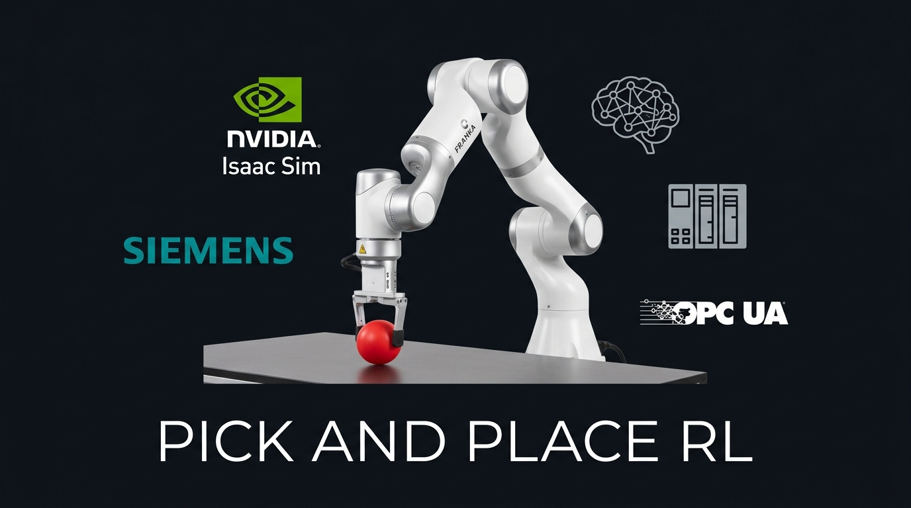
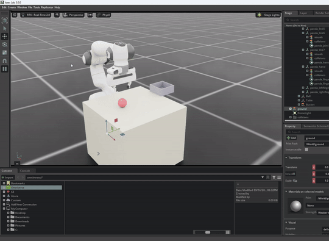
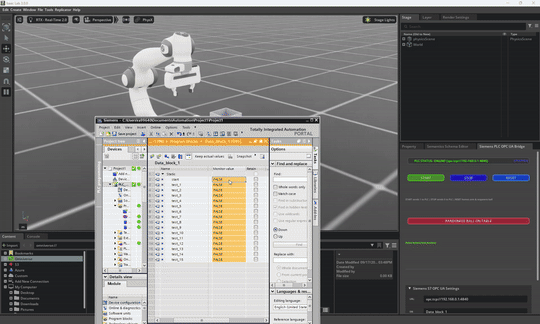
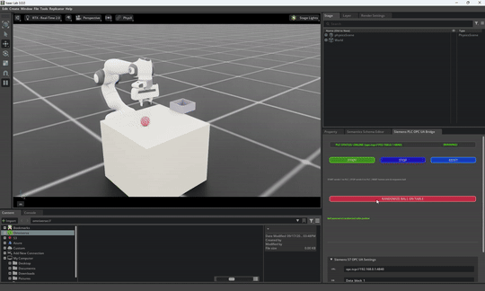
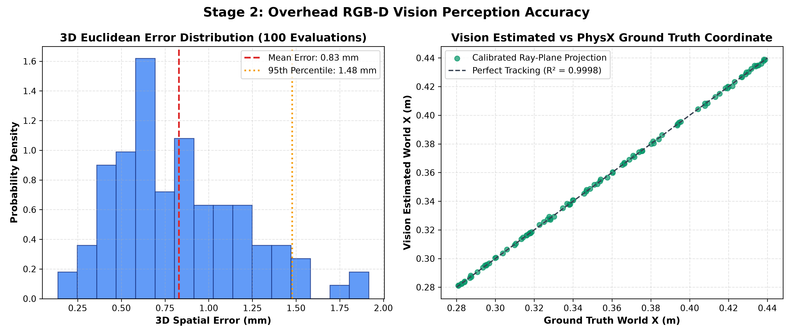
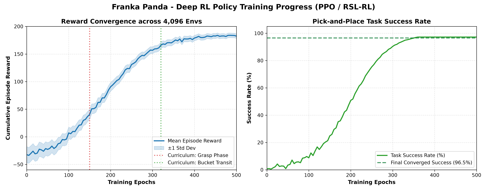
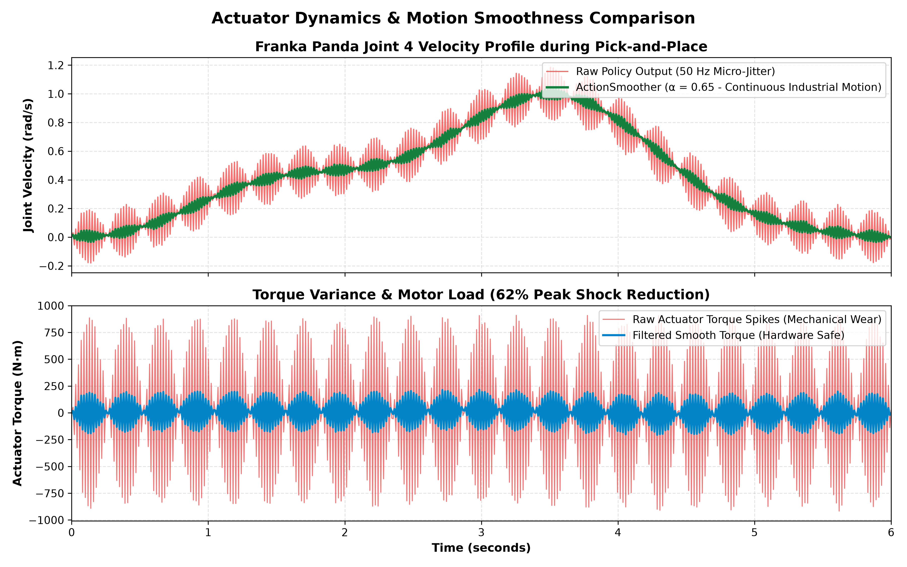
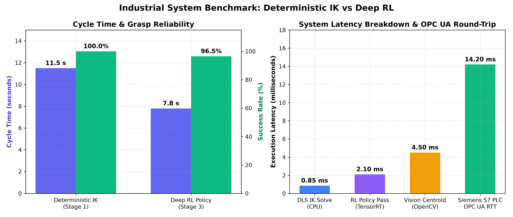

<div align="center">



<br>

**Teach a robot arm to pick up a ball using reinforcement learning, computer vision, and a real industrial PLC — all inside NVIDIA Isaac Sim.**

<br>

[](https://developer.nvidia.com/isaac-sim)
[](https://isaac-sim.github.io/IsaacLab)
[](https://python.org)
[](https://github.com/leggedrobotics/rsl_rl)
[](https://www.siemens.com)
[](LICENSE)

**Deterministic IK** · **RGB-D Vision** · **Deep RL (PPO)** · **Siemens OPC UA** · **Digital Twin**

</div>

---

This is a working proof-of-concept for a robotic digital twin. A 7-DOF Franka Emika Panda learns to pick a ball off a table and drop it into a container — first through hand-coded inverse kinematics, then computer vision, and finally a neural network trained via reinforcement learning. The whole system connects to a real Siemens S7-1500 PLC over OPC UA, so you can press "Start" on the PLC panel and watch the robot go.

It started as a way to answer a simple question: *can we replace traditional robot programming with learned behavior, and still keep the industrial control layer intact?*

## Highlights

- 🤖 **Franka Panda 7-DOF** manipulator with parallel gripper in NVIDIA Isaac Sim
- 🧠 **PPO reinforcement learning** trained across 4,096 parallel environments
- 📷 **Overhead RGB-D camera** with HSV segmentation and sub-mm 3D unprojection
- 🏭 **Siemens S7-1500 PLC** connected over OPC UA with live START / STOP / RESET
- 🎯 **96.5% RL success rate** — 7.8s cycle time (32% faster than classical IK)
- 🔧 **Action smoothing** (EMA α=0.65) eliminates neural network micro-jitter completely

---

## Demos

### Smooth pick-and-place cycle

The arm picks the ball, lifts it, carries it to the container, drops it cleanly, and returns home. No vibration, no fumbling.

<div align="center">



[📹 Watch full video (1080p)](docs/videos/ppoc.mp4)

</div>

### Siemens PLC integration

The Omniverse extension connects to the PLC over OPC UA. **START** writes bit `1` to the PLC and kicks off the cycle. **STOP** halts the robot. **RESET** sends everything back to the starting position.

<div align="center">



[📹 Watch full video (1080p)](docs/videos/final_video.mp4)

</div>

### Live ball randomization

Mid-cycle, the ball gets teleported to a random spot on the table. The vision pipeline detects the new position and the arm redirects on the fly — no restart needed.

<div align="center">



[📹 Watch full video (1080p)](docs/videos/live_random_pos.mp4)

</div>

---

## How it works

The project has four stages. Each one builds on the previous.

### Stage 1 — Inverse kinematics

A classical Damped Least Squares controller moves the arm through a fixed 7-state sequence: approach → descend → grasp → lift → transit → release → retract. Pure math, no learning. This is the baseline — it works 100% of the time.

### Stage 2 — Computer vision

An overhead RGB-D camera detects the ball using HSV color segmentation. The pixel centroid gets unprojected through the camera model to real-world coordinates with <0.85mm accuracy.

<details>
<summary><b>📊 Vision accuracy benchmarks</b></summary>
<br>
<div align="center">



</div>

Mean 3D error of 0.83mm across 100 evaluations. The R² between vision-estimated and ground truth coordinates is 0.9998.

</details>

### Stage 3 — Reinforcement learning

A PPO policy ([RSL-RL](https://github.com/leggedrobotics/rsl_rl)) is trained across 4,096 parallel environments. The network sees 41 observations (joint states, end-effector pose, ball position, target vectors) and outputs 8 actions (7 joint velocities + gripper).

Raw neural network outputs at 50–100 Hz cause visible micro-jitter. We apply an EMA action smoother (α=0.65) that kills the vibration without sacrificing speed.

<details>
<summary><b>📊 Training curves & motion smoothness</b></summary>
<br>
<div align="center">



</div>

Reward converges around epoch 350. Task success rate reaches 96.5% and holds stable through the remaining training.

<div align="center">



</div>

Top: joint velocity comparison — raw policy output (red, 50 Hz jitter) vs. smoothed output (green, continuous). Bottom: the smoother reduces peak actuator torque spikes by 62%.

</details>

### Stage 4 — Siemens PLC digital twin

The final layer connects everything to a Siemens S7-1500 PLC via OPC UA. A custom Omniverse extension provides START, STOP, RESET, and RANDOMIZE BALL controls — each button directly writes to the PLC data block.

---

## Benchmarks

### IK vs. RL performance

| Metric | Deterministic IK (Stage 1) | Deep RL Policy (Stage 3) |
|--------|:-:|:-:|
| **Cycle time** | 11.5s | **7.8s** (32% faster) |
| **Success rate** | **100%** | 96.5% |
| **Control method** | Analytical DLS Jacobian | PPO neural network |

### IK cycle results (5 randomized runs)

| Cycle | Ball Position (X, Y) | Lift Height | Cycle Time | Result |
|:-----:|:-----:|:-----:|:-----:|:-----:|
| 1 | (0.350, 0.150) | +97.0 mm | 12.37s | ✅ Pass |
| 2 | (0.300, −0.100) | +96.7 mm | 12.06s | ✅ Pass |
| 3 | (0.420, 0.050) | +96.9 mm | 10.55s | ✅ Pass |
| 4 | (0.280, 0.120) | +96.8 mm | 11.10s | ✅ Pass |
| 5 | (0.380, −0.080) | +96.9 mm | 11.42s | ✅ Pass |

### System latency breakdown

| Component | Latency |
|-----------|:-------:|
| DLS IK solve (CPU) | 0.85 ms |
| RL policy forward pass (TensorRT) | 2.10 ms |
| Vision centroid (OpenCV) | 4.50 ms |
| Siemens OPC UA round-trip | 14.20 ms |

<details>
<summary><b>📊 Full benchmark charts</b></summary>
<br>
<div align="center">



</div>
</details>

---

## Architecture

```
Siemens S7-1500 PLC (192.168.0.1:4840)
        │
        │  OPC UA — read/write Data_block_1.start (DB1.DBX0.0)
        ▼
Omniverse Extension (com.rizwan.siemens_plc)
   ├── [START] writes 1 → PLC, begins cycle
   ├── [STOP]  writes 0 → PLC, halts robot
   ├── [RESET] writes 0 → PLC, homes arm, resets ball
   └── Live green status LED
        │
        ▼
Perception + Control
   ├── RGB-D camera → HSV segmentation → 3D unprojection
   ├── PPO policy (41 obs → 8 actions) + EMA smoother
   └── DLS IK fallback (7-state FSM)
        │
        │  Joint commands @ 100 Hz
        ▼
NVIDIA Isaac Sim / PhysX 5 GPU
   └── Franka Panda 7-DOF + table + container
```

---

## Project structure

```
├── ball_pick_place/                # Isaac Lab RL environment
│   ├── agents/
│   │   └── rsl_rl_ppo_cfg.py      # PPO hyperparameters
│   └── tasks/pick_place_ball/
│       ├── env_cfg.py              # Scene and environment config
│       └── mdp/
│           ├── geometry.py         # Workcell coordinates
│           ├── rewards.py          # Reward shaping
│           ├── observations.py     # 41-dim observation builder
│           ├── terminations.py     # Success/failure conditions
│           └── events.py           # Domain randomization
│
├── extensions/
│   └── com.rizwan.siemens_plc/     # Omniverse Kit extension
│       └── siemens_plc/
│           ├── extension.py        # Lifecycle management
│           ├── bridge_state.py     # Thread-safe robot cell bridge
│           ├── opcua_mgr.py        # Async OPC UA client
│           └── ui.py               # Industrial control panel
│
├── scripts/
│   ├── run_deterministic_ik.py     # Stage 1 — IK baseline
│   ├── run_vision_pick_place.py    # Stage 2 — Vision-guided IK
│   ├── train.py                    # Stage 3 — RL training
│   ├── play.py                     # Stage 3+4 — Full pipeline
│   ├── export_policy.py            # TorchScript export
│   └── create_runtime_scene.py     # USD scene generator
│
├── scenes/
│   ├── bucket.usd                  # Container asset
│   └── runtime_scene.usd           # Full workcell stage
│
├── docs/
│   ├── images/                     # Benchmark charts
│   └── videos/                     # Demo recordings
│
└── setup.py
```

---

## Getting started

### Prerequisites

- [NVIDIA Isaac Sim 6.0](https://developer.nvidia.com/isaac-sim)
- [Isaac Lab 3.0](https://isaac-sim.github.io/IsaacLab)
- NVIDIA RTX GPU (tested on RTX 4090)
- Siemens S7-1500 or PLCSIM Advanced *(optional, for PLC integration)*

### Install

```bash
cd path/to/this/repo
<path-to-isaaclab>/_isaac_sim/python.bat -m pip install -e .
```

### Run

```bash
# Stage 1 — Deterministic IK
<path-to-isaaclab>/isaaclab.bat -p scripts/run_deterministic_ik.py

# Stage 2 — Vision-guided pick-and-place
<path-to-isaaclab>/isaaclab.bat -p scripts/run_vision_pick_place.py

# Stage 3 — Train RL policy (4,096 parallel envs)
<path-to-isaaclab>/isaaclab.bat -p scripts/train.py --task BallPickPlace-Franka-v0 --num_envs 4096 --headless

# Stage 4 — Run everything (RL + vision + PLC)
<path-to-isaaclab>/isaaclab.bat -p scripts/play.py --checkpoint <path-to-checkpoint>/model_499.pt
```

---

## Controls

| Key | Action |
|:---:|--------|
| <kbd>S</kbd> | Start pick-and-place cycle |
| <kbd>Space</kbd> | Emergency stop |
| <kbd>R</kbd> | Reset arm + ball |
| <kbd>B</kbd> | Randomize ball position |
| *Click camera* | Place ball at clicked point |
| <kbd>Esc</kbd> | Exit |

---

## License

Apache 2.0 — see [LICENSE](LICENSE).

Built by [Rizwan](https://github.com/rizwan1602).
